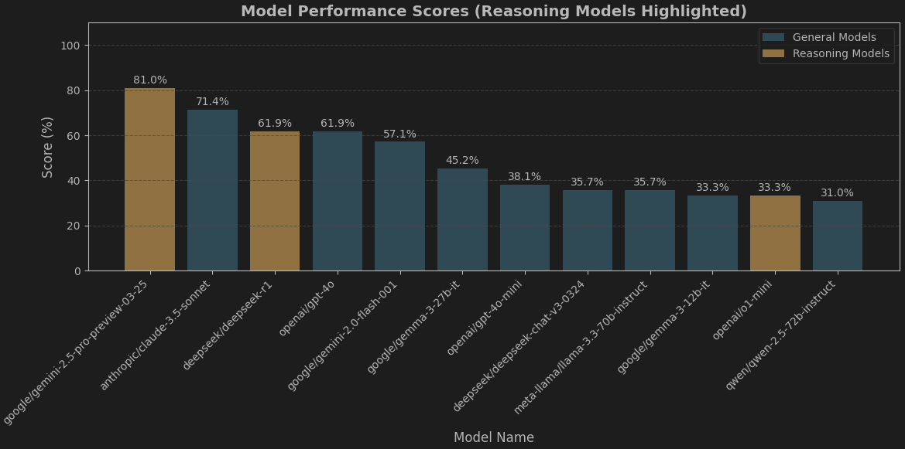

# Persian Poetry Semantic Similarity Benchmark

This repository benchmarks different embedding models to assess their performance in understanding semantic similarity (قرابت معنایی) in Persian classic poetry.

---

## Experiment #1: LLM Quiz – Understanding Persian Poetry

In this experiment, we evaluated some of the SOTA large language models on their ability to interpret the conceptual meaning of Persian poetry couplets, known as *beits*. Each *beit* consists of two lines (*mesra*) and conveys a distinct message or idea.

We designed a set of 42 multiple-choice questions. Each question follows the same format but contains different poetry options. The task was to identify the one *beit* whose conceptual meaning differs from the others.

### System Prompt

The models received the following system prompt:

```
You are an AI assistant analyzing Persian poetry couplets. Identify the outlier based on concept/message. Respond *only* with the single digit number (1, 2, 3, or 4) of the outlier option. Output nothing else.
```

### Sample Question

```
Analyze the conceptual meaning of the following options:

Options:
1. چو در وقت بهار آیی پدیدار - حقیقت، پرده برداری ز رخسار  
2. فروغ رویت اندازی سوی خاک - عجایب نقشها سازی سوی خاک  
3. از جلوه وجود تو ظلمت سرای خاک - روشن تر از جمال بتان طراز باد  
4. جلوه‌ای کرد رُخت دید ملک عشق نداشت - عین آتش شد از آن غیرت و بر آدم زد  

Instruction: Identify the *single* option (by its number) that has a different concept and message from the others. Respond with *only* the number (1, 2, 3, or 4). Do not provide any explanation or other text.
```

### Results

Here’s how the models performed, ranked by accuracy (percentage of correct outlier identifications out of 42 questions):

```
1. google/gemini-2.5-pro-preview-03-25 – 80.95%  
2. anthropic/claude-3.5-sonnet – 71.43%  
3. deepseek/deepseek-r1 – 61.90%  
4. openai/gpt-4o – 61.90%  
5. google/gemini-2.0-flash-001 – 57.14%  
6. google/gemma-3-27b-it – 45.24%  
7. openai/gpt-4o-mini – 38.10%  
8. deepseek/deepseek-chat-v3-0324 – 35.71%  
9. meta-llama/llama-3.3-70b-instruct – 35.71%  
10. google/gemma-3-12b-it – 33.33%  
11. openai/o1-mini – 33.33%  
12. qwen/qwen-2.5-72b-instruct – 30.95%  
```


