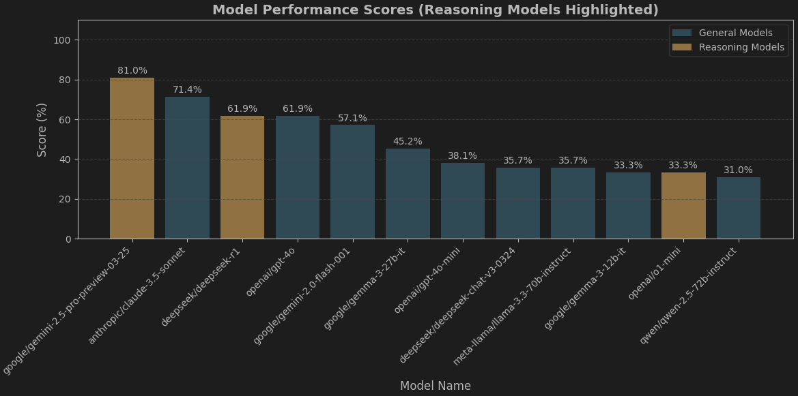
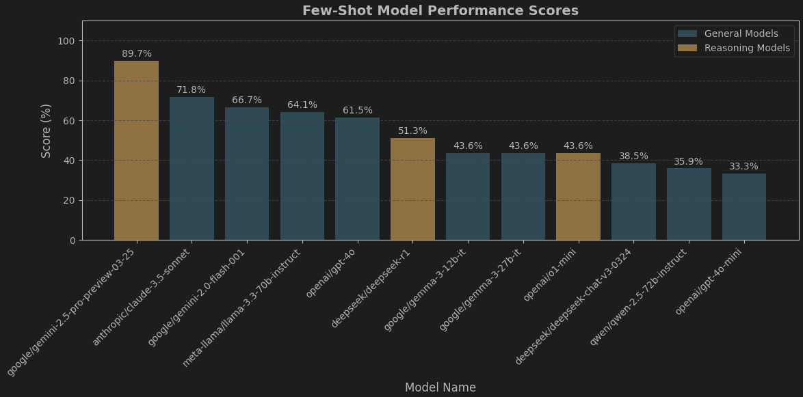

# Persian Poetry Semantic Similarity Benchmark

This repository benchmarks different embedding models to assess their performance in understanding semantic similarity (قرابت معنایی) in Persian classic poetry.

---

## Experiment #1: LLM Quiz – Understanding Persian Poetry

In this experiment, we evaluated some of the SOTA large language models on their ability to interpret the conceptual meaning of Persian poetry couplets, known as *beits*. Each *beit* consists of two lines (*mesra*) and conveys a distinct message or idea.

We tested a set of 42 multiple-choice questions on zero-shot prompting and 39 on few-shot prompting. Each question follows the same format but contains different poetry options. The task was to identify the one *beit* whose conceptual meaning differs from the others.

### Zero-Shot Prompting

#### System Prompt

The models received the following system prompt:

```
You are an AI assistant analyzing Persian poetry couplets. Identify the outlier based on concept/message. Respond *only* with the single digit number (1, 2, 3, or 4) of the outlier option. Output nothing else.
```

#### Sample Question

```
Analyze the conceptual meaning of the following options:

Options:
1. چو در وقت بهار آیی پدیدار - حقیقت، پرده برداری ز رخسار  
2. فروغ رویت اندازی سوی خاک - عجایب نقشها سازی سوی خاک  
3. از جلوه وجود تو ظلمت سرای خاک - روشن تر از جمال بتان طراز باد  
4. جلوه‌ای کرد رُخت دید ملک عشق نداشت - عین آتش شد از آن غیرت و بر آدم زد  

Instruction: Identify the *single* option (by its number) that has a different concept and message from the others. Respond with *only* the number (1, 2, 3, or 4). Do not provide any explanation or other text.
```

#### Results

Here’s how the models performed, ranked by accuracy (percentage of correct outlier identifications out of 42 questions):





### Few-Shot Prompting

The models received the following system prompt:

```
You are an expert literary critic with a deep understanding of Persian poetry, its cultural nuances, and its stylistic features. Your task is to analyze a set of poetic options—each option presenting two parts of a couplet—and identify the one option that deviates in conceptual meaning or thematic message from the others. Focus exclusively on the underlying concepts, disregarding stylistic or linguistic differences.

For example:

---
Options:
1. طریق عشق پرآشوب و فتنه است ای دل - بیفتد آن که در این راه با شتاب رود
2. گر نور عشق حق به دل و جانت اوفتد - بالله از آفتاب فلک خوبتر شوی
3. شکوه عشق نگه کن که موی مجنون را - فلک به شعشعه آفتاب، شانه کند
4. فرزانه درآید به پری خانه مقصود - هر کس که در این بادیه دیوانه عشق است

Correct answer: 1

(Option 1 warns against hastily pursuing the turbulent path of love, whereas the other options present love as an uplifting force)

---
Options:
1. شمشیر نیک از آهن بد چون کند کسی؟ - ناکس تربیت نشود ای حکیم کس
2. سگ به دریای هفت گانه بشوی - که چو تر شد پلیدتر باشد
3. ز وحشی نیاید که مردم شود - به سعی اندر او تربیت گم شود
4. سگ اصحاب کهف روزی چند - پی نیکان گرفت و مردم شد

Correct answer: 4

(Option 4 emphasizes the significant impact of upbringing, unlike the other options which imply that upbringing makes little difference)

---
Options:
1. هر چند خوشگوار بود باده غرور - زین می فزون از سنگ نگه دار شیشه را
2. از ساده دلی هر که دهد پند به مغرور - بیدار به افسانه کند خواب گران را
3. کبر مفروش به مردم که به میزان نظر - زود گردد سبک آن کس که بود سنگین تر
4. خاک بر فرقش اگر از کبر سر بالا کند - هر که داند بازگشت او به غیر از خاک نیست

Correct answer: 2

(The meaning of option 2 is the ineffectiveness of giving advice to the arrogant, while the common meaning of the other options is the recommendation to avoid arrogance)
```

#### Sample Question

```
Analyze the conceptual meaning of the following options:

Options:
1. چو در وقت بهار آیی پدیدار - حقیقت، پرده برداری ز رخسار  
2. فروغ رویت اندازی سوی خاک - عجایب نقشها سازی سوی خاک  
3. از جلوه وجود تو ظلمت سرای خاک - روشن تر از جمال بتان طراز باد  
4. جلوه‌ای کرد رُخت دید ملک عشق نداشت - عین آتش شد از آن غیرت و بر آدم زد  

Instruction: Identify the *single* option (by its number) that has a different concept and message from the others. Respond with *only* the number (1, 2, 3, or 4). Do not provide any explanation or other text.
```

#### Results

Here’s how the models performed, ranked by accuracy (percentage of correct outlier identifications out of 39 questions):


